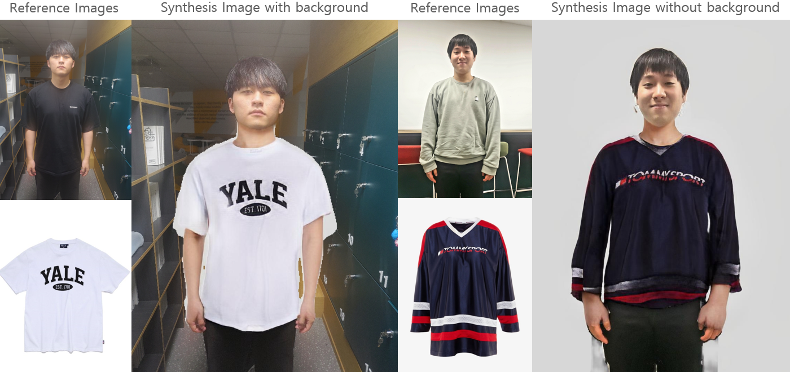
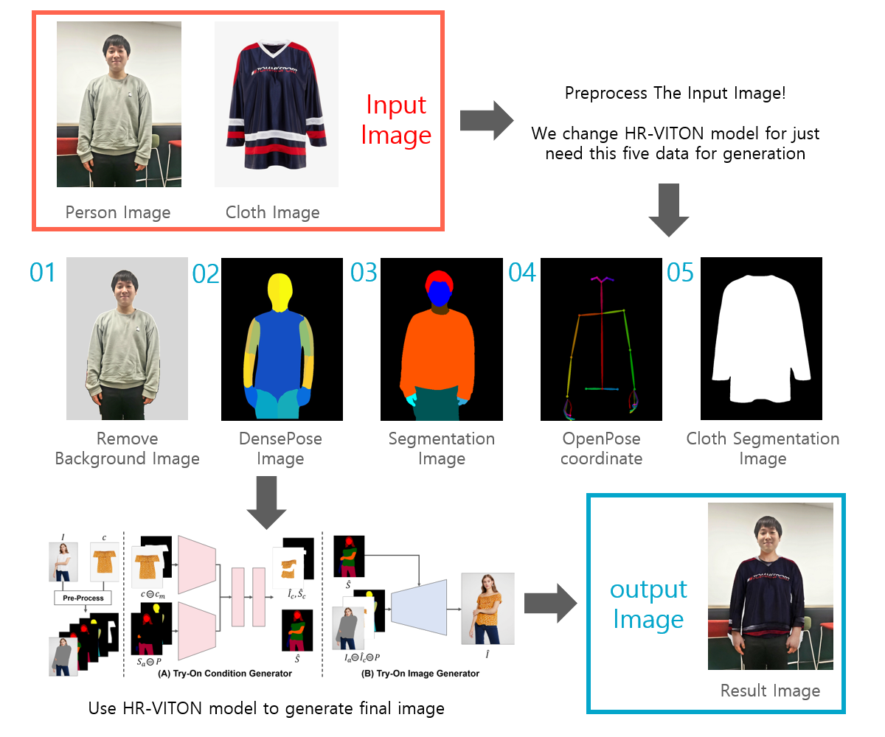

# TryYours - Virtual Try On site using HR-VITON.
  

## Colab Demo
You can simply try it using Colab:  

## Team Members

|Ahmed Ali Khan|Shadab Khan|
|--------------|------------|

## Process Overview

## Code Running Environment
> ## Run on colab

## Installation
check run file

## References
#### HR-VITON  
https://github.com/sangyun884/HR-VITON  
#### Posenet  
https://github.com/rwightman/posenet-python  
#### Graphonomy  
https://github.com/Gaoyiminggithub/Graphonomy  
#### Detectron2  
https://github.com/facebookresearch/detectron2  
#### Cloth Image Segmentation  
https://github.com/ternaus/cloths_segmentation
# virtual_tryon_demonstartion
